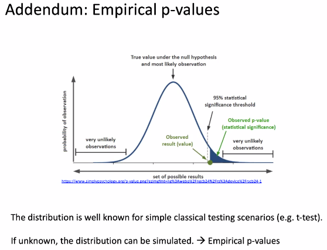
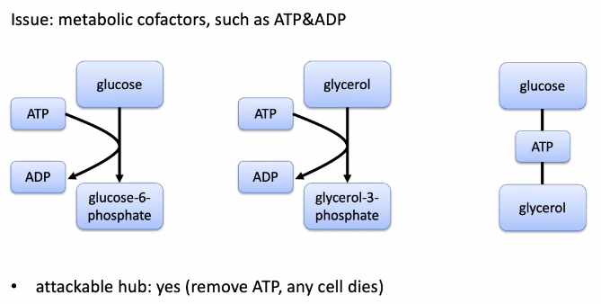
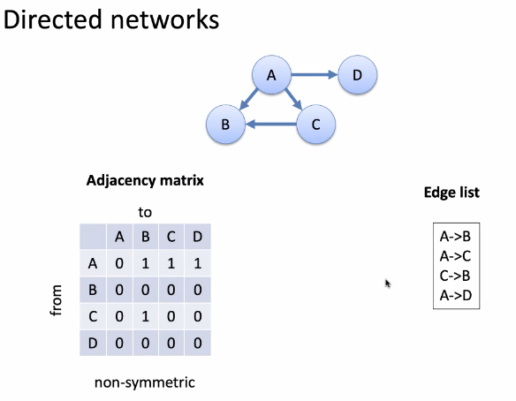
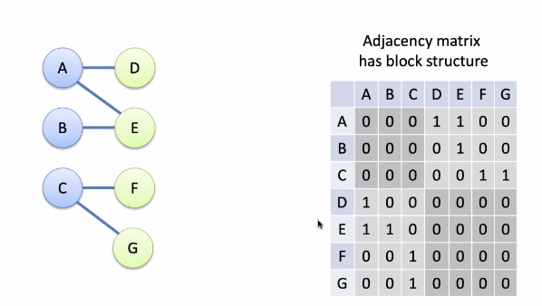
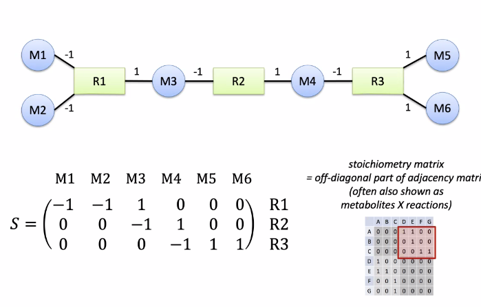
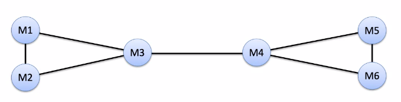
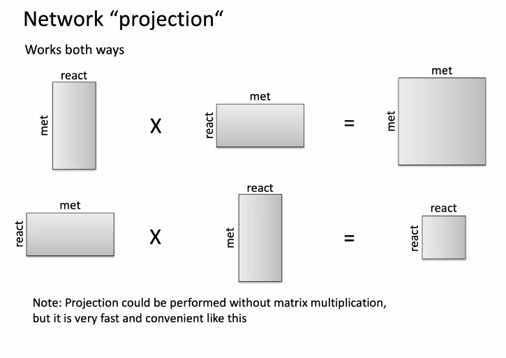
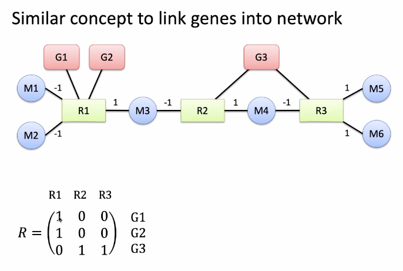
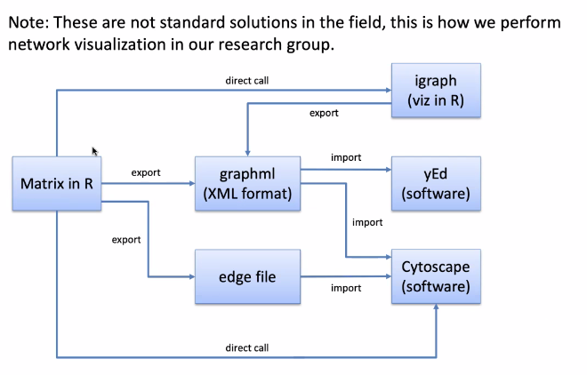

```{r setup, include=FALSE}
knitr::opts_chunk$set(echo = TRUE, 
                      message = FALSE, 
                      warning = FALSE, 
                      comment = NA)
```

## **Reviewing Background on Re-Sampling Methods**



P value -- The probability of observing the measured statistic (or more extreme) under the assumption that the null hypothesis is true

Most of the time, this distribution is known. However, when it is not known, we must simulate the experiments and **calculate** how many times that we actually see a more extreme statistic.

**Resampling Methods**: Bootstrap Sampling, Jacknife sampling

## Network analysis of metabolic pathways

Database: [string-db](string-db.org)

**PPI** -- Protein-Protein interaction -- used to mean touching (physical interaction), though now it can also mean connection between regualatory elements, transcription factors, etc...

2004 -- Network Biology (Nature Reviews) -- One of the first mentions of network in a computational context for biology -- Barabasi and Oltvai

Nodes (vertices) have degrees (number of connections). In a directed graph, we can have an in degree (num inputs) and out degree (num outputs)

Leaves -- nodes with one connection

Degree distribution -- how many nodes have a degree of x, where x varies

Scale-free network: Each subnetwork in the graph has the same properties

Jan: Metabolic networks are **not** scale free

**Clustering Coefficient**: Number of connections n between neighbors over all possible connections

$$
C = n / \frac{k(k-1)}{2}
$$

Hub has low clustering coefficeint, while deeper hierarchical structures are highly conncected for hierarchical networks, **not the case** for scale-free and random networks

**Main Messages**:

-   Bio netwoks are generally scale-free

-   This can happen due to preferrential attachment (new nodes attach to already connected nodes)

-   "Small-world" effects because of hubs -- network paths are generally short

-   Scale-free nature of networks makes them robust to random node failure (but suceptible to attacks on hubs) -- if we pick a random node and delete it, how many nodes are now unreachable

**Metabolic networks are also hierarchical -- NOT**

glucose-6-phosphate: phosphate added gives it a negative charge, and thus cannot then pass the membrane and leave the cell

ATP is a hub in this scenario -- though is not really a hub in a nework sense of speaking. These network issues fail due to specificities about the deep metabolic process



Lior Pachter -- very strongly critique of networks

Links in the slides

## Graph Theory and network representation

How do we actually work with these networks in R?

Three possible:

-   object-oriented graphs

-   Adjacency Matrix (can be really sparse)

-   Edge list (A--\>B, A--\>C, C--\>B)

Depends on computation vs space requirements

There is an RPacakage that presents the data to you as a matrix, though actually uses an edge-list interal representation



### Bipartite Networks

Networks that have 2 partitions. Essentially our network is split in two with **NO** interconnections between the subnetworks



**Directed Hypergraph** -- a graph where edges have more than one origin and can have more than one output

Replace the edges with a new node

Metoblites connect with reactions

Reactions connect with metabolites

NO CROSS TALK between metabolites themselves or reactions themselves -- **Stoichiometry Matrix**



**Network Projection:** Now we will connect metabolites that share a reaction -- Simplification that leads to loss of information



Can be done by **multiplying matrix with its own transpose**. Can also do the same for the reactions by reversing the multiplication





This format is used for the Recon database for metabolic reconstruction

## Visualization



OMIM database

Edge bundling algorithms

Vertex clumping -- by associated edges

Trey Ideker -- UCSD

graph diffusion kernels

<https://en.wikipedia.org/wiki/Simpson%27s_paradox>

<https://genomebiology.biomedcentral.com/articles/10.1186/s13059-019-1663-x>

<https://www.data-to-viz.com/graph/edge_bundling.html>

The dropout podcast -- 23 and me
