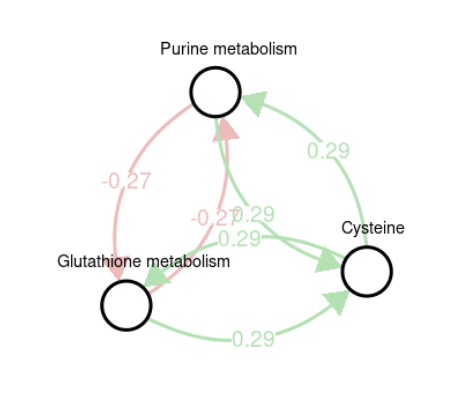

# **Metabolomics HW3: Network Analysis**


**A report by Jake Sauter and Nicholas Bartello**

date: "3/25/2021"


```r
library(magrittr)
library(dplyr)
library(knitr)
library(glue)
```

## **1. The human diseasome**

### **1.1 Loading the human diseasome**


```r
diseasome_data <- new.env()

load(file = '../data/Diseasome_preprocessed.RData', 
     env = diseasome_data)

ls(diseasome_data)
```

```
[1] "diseases_names" "diseasome"      "genes_names"   
```


```r
diseasome_data %>% 
  lapply(function(x) 
    glue("{typeof(x)}, length: {length(x)}"))
```

```
$diseases_names
list, length: 3

$diseasome
list, length: 3

$genes_names
list, length: 5
```


```r
diseasome_data$diseases_names %>% 
  head() %>% 
  kable()
```


| Disease_ID| Disease_OMIM_entry|Disorder.name                                                      |
|----------:|------------------:|:------------------------------------------------------------------|
|          1|                  1|17,20-lyase deficiency, isolated, 202110 (3)                       |
|          2|                  3|2-methyl-3-hydroxybutyryl-CoA dehydrogenase deficiency, 300438 (3) |
|          3|                  4|2-methylbutyrylglycinuria (3)                                      |
|          4|                  5|3-beta-hydroxysteroid dehydrogenase, type II, deficiency (3)       |
|          5|                  6|3-hydroxyacyl-CoA dehydrogenase deficiency, 609609 (3)             |
|          6|                  7|3-Methylcrotonyl-CoA carboxylase 1 deficiency, 210200 (3)          |


```r
diseasome_data$diseasome %>% 
  head() %>% 
  kable()
```


| Disease_ID| Gene_ID| Edge|
|----------:|-------:|----:|
|          1|       1|    1|
|          1|       2|    1|
|          1|       3|    1|
|          2|       4|    1|
|          2|       5|    1|
|          3|       6|    1|


```r
diseasome_data$genes_names %>% 
  head() %>% 
  kable()
```


| Gene_ID|Gene.symbols | GENE_OMIM_entry|Chromosome |Class     |
|-------:|:------------|---------------:|:----------|:---------|
|       1|CYP17A1      |          609300|10q24.3    |Endocrine |
|       2|CYP17        |          609300|10q24.3    |Endocrine |
|       3|P450C17      |          609300|10q24.3    |Endocrine |
|       4|HADH2        |          300256|Xp11.2     |Metabolic |
|       5|ERAB         |          300256|Xp11.2     |Metabolic |
|       6|ACADSB       |          600301|10q25-q26  |Metabolic |

**Question:** The data frame `diseasome_data$diseasome` is the Human Diseasome in edge list format (the first two columns are indices into the disease and gene list, respectively). How many diseases and genes are in the Diseasome? How many edges do you see?

**Answer:**

How may **dieseases** are in the diseasome:


```r
diseasome_data$diseasome %>% 
  as.data.frame() %>% 
  summarise(num_diseases = length(unique(Disease_ID)))
```

```
  num_diseases
1         1284
```

How may **genes** are in the diseasome:


```r
diseasome_data$diseasome %>% 
  as.data.frame() %>% 
  summarise(num_genes = length(unique(Gene_ID)))
```

```
  num_genes
1      3833
```

How may **edges** are in the diseasome:


```r
diseasome_data$diseasome %>% 
  as.data.frame() %>% 
  summarise(num_edges = sum(Edge))
```

```
  num_edges
1      6277
```

## **1.2 Diseases by Genes Matrix**

**Transform the loaded edge list into a matrix, where rows correspond to diseases, columns to genes, and an entry to whether an edge exists between the respective disease and gene. What are the dimensions of the matrix?**


```r
diseases <- unique(diseasome_data$diseasome$Disease_ID)
genes <- unique(diseasome_data$diseasome$Gene_ID)

disease_by_genes <- 
  matrix(nrow = length(diseases), 
         ncol = length(genes),
         data = 0)

for (i in seq_len(nrow(diseasome_data$diseasome))) {
  edge <- diseasome_data$diseasome[i, ]
  disease <- edge[[1]]
  gene <- edge[[2]]
  disease_by_genes[disease, gene] = edge[[3]]
}

disease_by_genes %>% 
  dim()
```

```
[1] 1284 3833
```

### **1.3 Generate the Human Disease Network**

**Generate the Human Disease Network (HDN, Figure 1 in Goh et al.) by multiplying the matrix with its own transpose, see lecture. What are the dimensions of the HDN matrix? What are the numeric values in the matrix?**


```r
hdn <- 
  disease_by_genes %*% 
      t(disease_by_genes)

hdn %>% 
  dim()
```

```
[1] 1284 1284
```

**Numeric values**


```r
hdn %>% 
  table() %>% 
  kable()
```


|.   |    Freq|
|:---|-------:|
|0   | 1644180|
|1   |    1043|
|2   |     980|
|3   |     944|
|4   |     592|
|5   |     297|
|6   |     178|
|7   |     179|
|8   |      82|
|9   |      34|
|10  |      32|
|11  |      13|
|12  |       8|
|13  |      19|
|14  |      11|
|15  |       9|
|16  |       3|
|17  |       4|
|18  |       7|
|19  |       3|
|20  |       2|
|21  |       1|
|22  |       1|
|23  |       4|
|24  |       5|
|25  |       2|
|26  |       3|
|27  |       1|
|28  |       2|
|29  |       2|
|34  |       1|
|35  |       1|
|40  |       1|
|41  |       1|
|46  |       1|
|48  |       1|
|49  |       2|
|58  |       1|
|65  |       1|
|67  |       1|
|68  |       1|
|71  |       1|
|76  |       1|
|113 |       1|

### **1.4 Visualize the HDN**


```r
library(igraph)

nonzero_diseases <- c()

adj_mat <- hdn

disease_names <- 
  sapply(1:nrow(adj_mat), 
    function(x) {
      diseasome_data$diseases_names %>% 
        .[.$Disease_ID == x, 'Disorder.name'] %>% 
        as.character()
  })

rownames(adj_mat) <- disease_names
colnames(adj_mat) <- disease_names

for (i in seq_len(nrow(adj_mat))) {
  adj_mat[i, i] <- 0 
}

for (i in seq_len(nrow(adj_mat))) {
  if (any(adj_mat[i, ] != 0) |
      any(adj_mat[, i] != 0)) {
     nonzero_diseases %<>% append(i)
  }
}

adj_mat <- adj_mat[nonzero_diseases, nonzero_diseases]

graph <- graph.adjacency(adj_mat, 
                         diag = FALSE, 
                         mode = 'directed')

size <- degree(graph) / 10

size <- ifelse(size < 1, 1, size)
size <- ifelse(size > 2, 2, size)

V(graph)$size <- size
V(graph)$name <- ""

png('superpathway_graph.png',
    width  = 1000,
    height = 1000)

par(mai=c(0,0,1,0))

plot(graph, 
     layout=layout_components(graph), 
     edge.arrow.size = 0.3,
     vertex.label.font = 2,
     vertex.label.cex = 0.9,
     vertex.frame.color = 'darkslategrey')

dev.off()
```

```
png 
  2 
```


**Show a detailed sub-network of your choice**


```r
components <- c(841, 668, 16, 617, 507, 767, 697, 76)


sub_adj_mat <- adj_mat[components, components]

graph <- graph.adjacency(sub_adj_mat, 
                         diag = FALSE, 
                         weighted = TRUE,
                         mode = 'directed')

size <- degree(graph) / 5
size <- ifelse(size < 5, 5, size)
# size <- ifelse(size > 3, 3, size)
V(graph)$size <- size
# V(graph)$name[degree(graph) < 15] <- ""

png('sub_graph.png',
    width  = 800,
    height = 600)

par(mai=c(0,0,1,0))

library(qgraph)

node_names <- 
  colnames(sub_adj_mat) %>%  
  stringr::str_extract('[A-Za-z -]+')

qgraph(
    sub_adj_mat, 
    edge.labels=T, 
    labels = node_names,
    label.scale = F,
    label.font = 2,
    label.cex = 1.2,
    label.scale.equal = T,
    node.label.offset = c(.4, 4)
)

dev.off()
```


## **2. Pathway GGMs**

Note that this excercise is following **Do et al., NPJ Syst Biol Appl. 2017;3:28, DOI: 10.1038/s41540-017-0029-9**, accessible at the following ncbi link: <https://www.ncbi.nlm.nih.gov/pmc/articles/PMC5608949/>.

### **2.1: Loading Metabolomics Data**

Load the metabolomics data (`QMDiab_preprocessed_data_withggm.Rdata`). This dataset is similar to the dataset in previous exercises, but has been preprocessed already. Metabolites are in columns and samples are in rows of the dat data frame. Annotations of the metabolites can be found in annotations and information on type 2 diabetes status is stored in variable T2D, with 0 = control and 1 = diabetic


```r
metabolomics_data_env <- new.env()

load('../data/QMDiab_preprocessed_data_withggm.RData', 
     envir = metabolomics_data_env)

ls(metabolomics_data_env)
```

```
[1] "annotations" "dat"         "ggm"         "pvals"       "T2D"        
```

Metabolites are in columns and samples are in rows of the `dat` data frame.


```r
metabolomics_data_env %>% 
  .$dat %>% 
  .[1:5, 1:3] %>% 
  kable()
```


| 1,11-Undecanedicarboxylic acid| 1,2-dipalmitoylglycerol| 1,2-propanediol|
|------------------------------:|-----------------------:|---------------:|
|                       9.252081|                11.09382|        11.74461|
|                       9.609541|                11.54062|        11.65240|
|                       8.778313|                11.42194|        11.92770|
|                       9.862617|                11.12292|        11.57343|
|                       8.986285|                11.28169|        12.13025|

Annotations of the metabolites can be found in `annotations`


```r
metabolomics_data_env %>% 
  .$annotations %>% 
  .[1:5, 1:3] %>% 
  kable()
```


|PATHWAY_SORTORDER |BIOCHEMICAL                    |SUPER_PATHWAY |
|:-----------------|:------------------------------|:-------------|
|800.1             |1,11-Undecanedicarboxylic acid |Lipid         |
|1070              |1,2-dipalmitoylglycerol        |Lipid         |
|986               |1,2-propanediol                |Lipid         |
|1805              |1,3,7-trimethylurate           |Xenobiotics   |
|600               |1,3-dihydroxyacetone           |Carbohydrate  |

Information on type 2 diabetes status is stored in variable T2D, with 0 = control and 1 = diabetic


```r
metabolomics_data_env %>% 
  .$T2D %>% 
  table() %>% 
  kable()
```


|.  | Freq|
|:--|----:|
|0  |  177|
|1  |  181|

### **2.2: Generate and Visualize Pathway GGM**

**Generate and visualize a GGM of pathways using the methods from the first two assignments of this lecture block. Use the eigengene approach for aggregation. The network will be similar to Fig 2(b) and (c) from the paper (<https://www.ncbi.nlm.nih.gov/pmc/articles/PMC5608949/figure/Fig2/>). Note that we use a completely different dataset here that doesn't have urine and saliva measurements.**

**Caluclating eigenmetabolite**


```r
pathways <-
  metabolomics_data_env %>% 
  .$annotations %>% 
  .$SUB_PATHWAY %>% 
  unique() %>% 
  na.exclude() %>% 
  as.character()

eigen_metabolites <- matrix(0, 
                            nrow = nrow(metabolomics_data_env$dat), 
                            ncol = length(pathways),
                            dimnames = list(c(), pathways))


explained_variances <- rep(0, length(pathways))
names(explained_variances) <- pathways

pathways <- na.omit(pathways)

for (pathway in pathways) {
  
  print(pathway)
  
  metabolites_in_pathway <-
    metabolomics_data_env %>% 
    .$annotations %>% 
    filter(SUB_PATHWAY == pathway) %>% 
    .$BIOCHEMICAL
    
    
    subpathway_data <- 
      metabolomics_data_env$dat[,metabolites_in_pathway] 
  
    df <- t(subpathway_data)
    
    for (i in 1:ncol(df)) {
      sample_data <- df[, i]
      sample_data <- sample_data - mean(sample_data)
      sample_var <- var(sample_data)
      if (length(sample_var) > 1 && sample_var > 0) {
        sample_data <- sample_data / sample_var
      }
      df[,i] <- sample_data
    }
    
    pathway_rep <- prcomp(t(subpathway_data),
                           rank = 1)
    
    sdev <- pathway_rep$sdev^2
    explained_var <- ifelse(sum(sdev) > 0, 
                            sdev[1] / sum(sdev), 
                            1)
    
    
    eigen_metabolites[,pathway] <- pathway_rep$rotation
    explained_variances[pathway] <- explained_var
}
```

```
[1] "Fatty acid, dicarboxylate"
[1] "Diacylglycerol"
[1] "Ketone bodies"
[1] "Xanthine metabolism"
[1] "Glycolysis, gluconeogenesis, pyruvate metabolism"
[1] "Lysolipid"
[1] "Histidine metabolism"
[1] "Monoacylglycerol"
[1] "Long chain fatty acid"
[1] "Medium chain fatty acid"
[1] "Fatty acid, monohydroxy"
[1] "Fatty acid, branched"
[1] "Butanoate metabolism"
[1] "Chemical"
[1] "Valine, leucine and isoleucine metabolism"
[1] "Cysteine, methionine, SAM, taurine metabolism"
[1] "Benzoate metabolism"
[1] "Sterol/Steroid"
[1] "Phenylalanine & tyrosine metabolism"
[1] "Carnitine metabolism"
[1] "Tryptophan metabolism"
[1] "Drug"
[1] "Pyrimidine metabolism, uracil containing"
[1] "Phenylalanine &amp; tyrosine metabolism"
[1] "Glutathione metabolism"
[1] "Purine metabolism, adenine containing"
[1] "Fibrinogen cleavage peptide"
[1] "Alanine and aspartate metabolism"
[1] "Purine metabolism, urate metabolism"
[1] "Krebs cycle"
[1] "Tocopherol metabolism"
[1] "Nucleotide sugars, pentose metabolism"
[1] "Urea cycle; arginine-, proline-, metabolism"
[1] "Glycine, serine and threonine metabolism"
[1] "Hemoglobin and porphyrin metabolism"
[1] "Polypeptide"
[1] "Fatty acid metabolism (also BCAA metabolism)"
[1] "Inositol metabolism"
[1] "Bile acid metabolism"
[1] "Glycerolipid metabolism"
[1] "Food component/Plant"
[1] "Creatine metabolism"
[1] "Dipeptide"
[1] "Dipeptide derivative"
[1] "Essential fatty acid"
[1] "Pyrimidine metabolism, orotate containing"
[1] "EDTA"
[1] "Sugar, sugar substitute, starch"
[1] "Aminosugars metabolism"
[1] "Advanced glycation end-product"
[1] "Fructose, mannose, galactose, starch, and sucrose metabolism"
[1] "gamma-glutamyl"
[1] "Glutamate metabolism"
[1] "Purine metabolism, (hypo)xanthine/inosine containing"
[1] "Fatty acid metabolism"
[1] "Lysine metabolism"
[1] "Oligosaccharide"
[1] "Nicotinate and nicotinamide metabolism"
[1] "Purine metabolism, guanine containing"
[1] "Fatty acid, methyl ester"
[1] "Sphingolipid"
[1] "Pantothenate and CoA metabolism"
[1] "Oxidative phosphorylation"
[1] "Vitamin B6 metabolism"
[1] "Fatty acid, amide"
[1] "Ascorbate and aldarate metabolism"
```


```r
pcor <- ppcor::pcor(eigen_metabolites)
names(pcor)
```

```
[1] "estimate"  "p.value"   "statistic" "n"         "gp"        "method"   
```


```r
p_vals <- pcor$p.value
hist(p_vals, 
     main = "P values of Partial Corellations", 
     xlab = "P values")
```

<!-- -->

**Bonferonni Correction**


```r
n <- ncol(eigen_metabolites)
n_tests <- (n*(n-1))/2 

adj_p_vals <- p_vals * n_tests
adj_p_vals[adj_p_vals > 1] = 1

hist(adj_p_vals[adj_p_vals < 1], 
     main = "P values of Partial Corellations Less Than 1", 
     xlab = "P values less than 1")
```

<!-- -->

**Below we set the insignificant values and the diagonal values to 0 in order to visualize the GGM.**


```r
adj_mat <- pcor$estimate
adj_mat[adj_p_vals > 0.05] = 0

for (i in 1:nrow(adj_mat)) {
  adj_mat[i, i] = 0
}

colnames(adj_mat) <- colnames(eigen_metabolites)
rownames(adj_mat) <- colnames(eigen_metabolites)
```

**Visualizing the Gaussian Graphical Model**


```r
library(igraph) 
library(qgraph)

# Assemble the non-zero matrix
nonzero_metabolites <- c()

for (metabolite in colnames(adj_mat)) {
  if (any(adj_mat[metabolite, ] != 0) |
      any(adj_mat[, metabolite] != 0)) {
     nonzero_metabolites %<>% append(metabolite)
  }
}

adj_mat <- adj_mat[nonzero_metabolites, nonzero_metabolites]

graph <- graph.adjacency(adj_mat, 
                         weighted = TRUE, 
                         diag = FALSE, 
                         mode = 'directed')

size <- degree(graph) / 10
size <- ifelse(size < 1, 1, size)
size <- ifelse(size > 5, 5, size)

V(graph)$size <- 4
V(graph)$name <- ""


png('GGM_graph.png',
    width  = 2000,
    height = 2000)

par(mai=c(0,0,1,0))


# Igraph code: 
# plot(graph, 
#      layout=layout_with_dh(graph), 
#      edge.arrow.size = 0.5, 
#      vertex.label.font = 2, 
#      vertex.label.cex = 0.9, 
#      vertex.frame.color = 'darkslategrey')

node_names <- 
  colnames(adj_mat) %>%  
  stringr::str_extract('[A-Za-z -]+')

qgraph(
    unname(adj_mat), 
    edge.labels=TRUE,
    edge.label.cex = .4,
    # labels = FALSE, 
    vsize =  2, 
    layout = layout_with_mds(graph), 
    labels = node_names, 
    label.scale = F,
    label.cex = 1.2,
    label.scale.equal = T,
    node.label.offset = c(.4, -3)
)


dev.off()
```


Very clear sub-structure:



### **2.3 Difference in Superpathway Network**

In the first two assignments, we calculated partial correlations and their p-values for the data using the ppcor package. We then performed multiple testing correction with Bonferroni correction, and set all insignificant values in the partial correlation matrix to zero. This matrix is the adjacency matrix of the underlying Gaussian graphical model, which we used igraph to create. We did this for both the sub-pathway and super-pathway networks.

In this paper, the metabolite and sub-pathway networks were created using the partial correlations and the pearson correlation coefficients that were significant. The super-pathway network of figure 2c was generated by collapsing the sub-pathway GGM. A link between two nodes was drawn if there was at least one connection between any two sub-pathways assigned to the two respective super-pathways in the underlying sub-pathway GGM.

## 3. Phenotype-driven Module Identificaiton

Again, this exercise follows the work of **Do et al., NPJ Syst Biol Appl. 2017;3:28, DOI: 10.1038/s41540-017-0029-9**, accessible at the following ncbi link: <https://www.ncbi.nlm.nih.gov/pmc/articles/PMC5608949/>.

### 3.1: The dataset

Still using previous dataset:


```r
metabolomics_data_env %>% 
  ls()
```

```
[1] "annotations" "dat"         "ggm"         "pvals"       "T2D"        
```

### 3.2: Type II Diabetes Associations

**Calculate the T2D associations for each metabolite using t-test or linear regression (metabolite \~ T2D). Perform multiple testing correction with a method and** α **of your choice.**


```r
df <- 
  metabolomics_data_env %>% 
  .$dat %>% 
  as.data.frame()

df %>% 
  .[1:5, 1:3] %>% 
  kable()
```


| 1,11-Undecanedicarboxylic acid| 1,2-dipalmitoylglycerol| 1,2-propanediol|
|------------------------------:|-----------------------:|---------------:|
|                       9.252081|                11.09382|        11.74461|
|                       9.609541|                11.54062|        11.65240|
|                       8.778313|                11.42194|        11.92770|
|                       9.862617|                11.12292|        11.57343|
|                       8.986285|                11.28169|        12.13025|

**For each metabolite, t-test normal group vs Type II diabetes group**


```r
metabolites <- colnames(df)
t2d <- metabolomics_data_env$T2D

t2d %>% 
  table() %>% 
  kable()
```


|.  | Freq|
|:--|----:|
|0  |  177|
|1  |  181|


```r
p_vals <- rep(NA, length(metabolites))
names(p_vals) <- metabolites

for (metabolite in metabolites) {
  metabolite_data <- df[, metabolite]
  control <- metabolite_data[t2d == 0]
  diabetes <- metabolite_data[t2d == 1]
  p_vals[metabolite] <- t.test(control, diabetes)$p.value
}

hist(p_vals, 
     main='P-values for Metabolites by Presence of Type II Diabetes', 
     xlab='P values')
```

<!-- -->

**Multiple Testing Correction**


```r
par(mfrow = c(1, 2))

hist(p_vals, 
     main='Original P-values', 
     xlab='P values')

adj_p_vals <- p.adjust(p_vals, 'bonferroni')
hist(adj_p_vals, 
     main='Bonferroni corrected P-values', 
     xlab='P values')
```

<!-- -->

**Significant Metabolites by Presence of Type II Diabetes**


```r
before <- length(which(p_vals < 0.01))
after <- length(which(adj_p_vals < 0.01))
bp <- barplot(c(before, after), 
        main = "Significant Metabolites by T2D", 
        ylab = "# Significant Metabolites", 
        names.arg = c('Before correction', 'After correction'), 
        col = c("#f45044", "#4496f4"))

text(bp, c(before,after)/2, labels = c(before,after), font = 2)
```

<!-- -->

### 3.3: Module Identification

Perform the first step of the module identification approach with the metabolite tryptophan (node ID = 345) as seed. For this purpose, use the loaded network represented as matrix in variable **ggm**.

**a.) Collect all neighbor nodes (candidates) of the seed node using the network. Compare the T2D association (p-values) of the seed node with its neighbors. Which neighbor has the highest T2D association?**


```r
seed <- 'tryptophan'
ggm <- metabolomics_data_env$ggm

candidates <- 
  sort(ggm[seed, ], 
       decreasing = TRUE) %>% 
  .[. > 0] 

candidates %>% 
  names %>% 
  p_vals[.] %>% 
  sort() %>% 
  kable()
```


|           |         x|
|:----------|---------:|
|X - 19380  | 0.0366295|
|tryptophan | 0.0810638|
|X - 18886  | 0.1807641|
|kynurenine | 0.6327322|

**above, we can see `X - 19380` is the neighbor of our seed `tryptophan` that has the highest T2D association.**

**b.) For each candidate** $c_i$ calculate the module representative $R_i$ of module seed, $c_i$ as the mean z-score. To get the z-score of the data use function `scale`. (Tip: Each candidate module has only two nodes, the seed tryptophan, and its neighbor).


```r
z_scores <- scale(ggm)

candidates <- 
  candidates %>% 
  .[names(.) != seed]

candidate_z_scores <- rep(NA, length(candidates))
names(candidate_z_scores) <- names(candidates)

z_scores <- 
  scale(candidates) %>% 
  as.numeric() %>% 
  set_names(names(candidates))

for (candidate in names(candidates)) {
  candidate_z_scores[candidate] <- 
    mean(z_scores[candidate])
}

candidate_z_scores
```

```
 X - 18886 kynurenine  X - 19380 
 0.7448462  0.3917124 -1.1365586 
```

**c.) Calculate the T2D associations for each candidate module by performing t-tests with the module representatives** $R_i$. For which neighbor do you get the best module


```r
p_vals <- rep(NA, length(candidates))
names(p_vals) <- names(candidates)

for (candidate in names(candidates)) {
  module_values <- df[, seed] + df[, candidate]
  p_vals[candidate] <- 
    t.test(module_values[t2d == 0], 
           module_values[t2d == 1])$p.value
}

p_vals %>% 
  kable()
```


|           |         x|
|:----------|---------:|
|X - 18886  | 0.8316636|
|kynurenine | 0.5822564|
|X - 19380  | 0.0258374|

The sub-module {`tryptophan`, `X - 19380`} provides the best p-value of all possible sub-modules.
